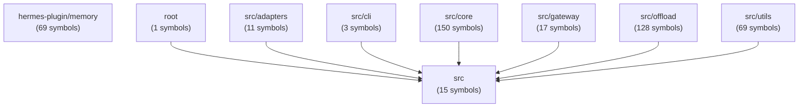

# Architecture Overview

> Codebase: `/Users/link/Documents/Anaconda/symphony-me/inputs/TencentDB-Agent-Memory`
> Total: 104 files · 33035 lines · 9 modules · 463 exported symbols

---

## Module Map

## Entry Point

- [[root]] — 4 files, 1 symbols

## Core Logic

- [[core]] — 36 files, 150 symbols

## Adapters

- [[adapters]] — 7 files, 11 symbols

## Offload Pipeline

- [[offload]] — 31 files, 128 symbols

## Gateway / API

- [[gateway]] — 3 files, 17 symbols

## CLI

- [[cli]] — 2 files, 3 symbols

## Utilities

- [[utils]] — 14 files, 69 symbols

## Plugin

- [[hermes-plugin-memory]] — 6 files, 69 symbols

## Other

- [[src]] — 1 files, 15 symbols

## Key Dependencies

### Most Depended-On Modules (Hub Nodes)

- `src` — depended on by **7** other modules

## Extraction Stats

| Module | Files | Symbols | Suggested Pages | Category |
|--------|-------|---------|-----------------|----------|
| [[hermes-plugin-memory]] | 6 | 69 | 2 | Plugin |
| [[root]] | 4 | 1 | 2 | Entry Point |
| [[src]] | 1 | 15 | 1 | Other |
| [[adapters]] | 7 | 11 | 3 | Adapters |
| [[cli]] | 2 | 3 | 1 | CLI |
| [[core]] | 36 | 150 | 8 | Core Logic |
| [[gateway]] | 3 | 17 | 1 | Gateway / API |
| [[offload]] | 31 | 128 | 8 | Offload Pipeline |
| [[utils]] | 14 | 69 | 5 | Utilities |
